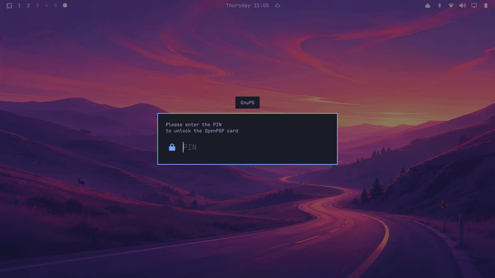

# pinentry-omarchy

[](https://github.com/lbssousa/pinentry-omarchy/actions/workflows/ci.yml)
[](https://scorecard.dev/viewer/?uri=github.com/lbssousa/pinentry-omarchy)

A GnuPG [pinentry](https://www.gnupg.org/related_software/pinentry/) for
[Omarchy](https://omarchy.org/) that asks for PINs and passphrases in the
same overlay dialog as the shell's polkit agent: same layer, scrim, card,
fonts, `[polkit]` theme colours and failure shake, following theme changes
live.



## How it works

```
gpg-agent ──Assuan (stdin/stdout)──▶ pinentry-omarchy (Rust)
                                        │ one NDJSON line each way
                                        ▼
            $XDG_RUNTIME_DIR/pinentry-omarchy.sock
                                        │
                  plugin lbssousa.pinentry (service) inside omarchy-shell
                                        │
                                  overlay dialog
```

- **`pinentry-omarchy`** (`src/`) speaks the pinentry Assuan protocol to
  gpg-agent: `GETPIN` (with `SETREPEAT`), `CONFIRM` (incl.
  `--one-button`), `MESSAGE`, the `SET*` texts and labels, `SETTIMEOUT`,
  `GETINFO`. For each prompt it sends the request over a connection to
  the plugin's socket (checking that the peer runs as the same user) and
  relays the answer. The connection opened at startup to check that the
  plugin is up carries the first prompt; the plugin closes each connection
  after answering.
- **The plugin** (`plugin/`) is a third-party Omarchy shell plugin of kind
  `service`. It reuses the shell's own `qs.Commons` (`Color`, `Style`,
  `Border`) and `qs.Ui` (`BorderSurface`, `Button`) instead of copying
  styles. One request is served at a time; a second one gets `busy`. A
  client that disconnects (gpg-agent killing the pinentry, for example)
  closes its dialog.
- **Fallback:** if there's no Wayland session or the plugin isn't
  listening when the pinentry starts, it `exec`s `pinentry-gnome3` (or
  `pinentry-curses` without a display) with the same arguments, before
  saying anything to gpg-agent. `PINENTRY_OMARCHY_FALLBACK` picks another
  program. If the shell goes away in the middle of a session, the pending
  prompt counts as cancelled.

### Protocol between the two halves (v2)

Request: `{"v":2,"type":"getpin"|"confirm"|"message","title","desc","prompt","error","ok","cancel","notok","repeat","repeatError","timeout"}`
(empty fields are omitted; `repeat` is the second field's placeholder;
`timeout` is in seconds, at most 86400).

Response: `{"result":"ok"|"cancel"|"notok"|"timeout"|"busy"|"error","pin"?,"message"?}`.
`pin` is the UTF-8 PIN, percent-encoded (`encodeURIComponent`). The binary
therefore parses it without any JSON unescaping, which would leave
unwiped copies. The plugin refuses requests from any other protocol
version, so a binary and a plugin from different releases can never pass
a PIN the other misreads. A misread PIN would still be sent to the card
and use up a try.

### Security notes

See [SECURITY.md](SECURITY.md) for the threat model and how to report a
vulnerability. In short:

- **Memory:** the binary locks its memory (`mlockall`) and turns off core
  dumps and ptrace (non-dumpable). Every copy of the PIN it makes lives in
  a zeroized buffer: the socket read buffer, the decoded PIN and the
  encoded `D` lines. It writes to gpg-agent unbuffered, so no stdio buffer
  keeps the PIN.
- **Socket:** it lives in the user's 0700 runtime directory, and the
  binary checks that the listening peer runs as the same user.
- **Displayed text:** texts from gpg-agent are stripped of control
  characters and bidirectional overrides (so a key's user ID can't
  disguise what is shown), and they are rendered as plain text, never
  rich text.
- **Assuan output:** responses to gpg-agent never carry raw control
  characters, so nothing the dialog says can inject protocol lines.
- **Inside omarchy-shell:** the PIN goes through a QML `TextInput` and the
  JavaScript heap, which can't be wiped. The fields are cleared as soon as
  the answer is sent. This is the same trade-off as the polkit dialog.

## Install

On Arch/Omarchy, build and install the package:

```sh
just pkg                                  # packaging/pinentry-omarchy-*.pkg.tar.zst
sudo pacman -U packaging/pinentry-omarchy-*.pkg.tar.zst
```

Then, per user:

```sh
ln -sfn /usr/share/pinentry-omarchy/plugin ~/.config/omarchy/plugins/lbssousa.pinentry
omarchy-shell shell enablePlugin lbssousa.pinentry '{}'
echo 'pinentry-program /usr/bin/pinentry-omarchy' >> ~/.gnupg/gpg-agent.conf
gpgconf --reload gpg-agent
```

[omarchy-setup](https://github.com/lbssousa/omarchy-setup) automates all
of this (`just pinentry`).

## Releases

`main` only takes squash-merged pull requests, which GitHub signs with its
own key. A release is therefore a **GPG-signed tag** made by the
maintainer on the merged commit. That tag, not `main`, is what gets
deployed: omarchy-setup checks out the tag and verifies it against the
maintainer's key before building.

1. Open a PR that bumps the version in `Cargo.toml` (then run
   `cargo update -w`), `packaging/PKGBUILD` and `plugin/manifest.json`.
   The same PR turns the "Unreleased" section of
   [CHANGELOG.md](CHANGELOG.md) into the new version's release notes.
   Merge it.
2. Tag the merge commit and push the tag:
   ```sh
   git switch main && git pull
   git tag -s vX.Y.Z -m "pinentry-omarchy X.Y.Z"
   git push origin vX.Y.Z
   ```
3. In omarchy-setup, set `pinentry_omarchy_ref` to the tag and run
   `just pinentry`.

## Development

| Recipe | What it does |
|---|---|
| `just test` | Unit tests, integration tests against a fake dialog, `cargo fmt --check` and clippy |
| `just test-plugin` | Protocol tests against the real QML plugin in a throwaway Quickshell instance (needs the Wayland session; dialogs flash on screen) |
| `just fuzz [target] [secs]` | Fuzzes the Assuan session, the dialog-reply parser or the `D`-line encoder with cargo-fuzz (needs nightly Rust and `cargo install cargo-fuzz`) |
| `just dev` | Runs the dialog in a separate Quickshell instance (`dev/`, which links the shell's `Commons`/`Ui`) on its own socket |
| `just try` | Sends a sample `GETPIN` through the `just dev` instance |
| `just link` | Loads this checkout's plugin in the real shell (restarts omarchy-shell) |
| `just pkg` | Builds the Arch package |

omarchy-shell doesn't reload a `keepLoaded` service when its files change,
and its file watcher doesn't follow the plugin symlink. Iterate with
`just dev`, and restart the shell when you're done.

## Feedback and contributing

- **Bugs and feature requests:** [GitHub issues](https://github.com/lbssousa/pinentry-omarchy/issues).
- **Security vulnerabilities:** report them privately, as described in
  [SECURITY.md](SECURITY.md).
- **Contributions:** pull requests are welcome. See
  [CONTRIBUTING.md](CONTRIBUTING.md) for the rules: tests with every change,
  signed commits, and CI passing.
- **Release notes:** [CHANGELOG.md](CHANGELOG.md).

## License

[MIT](LICENSE).
